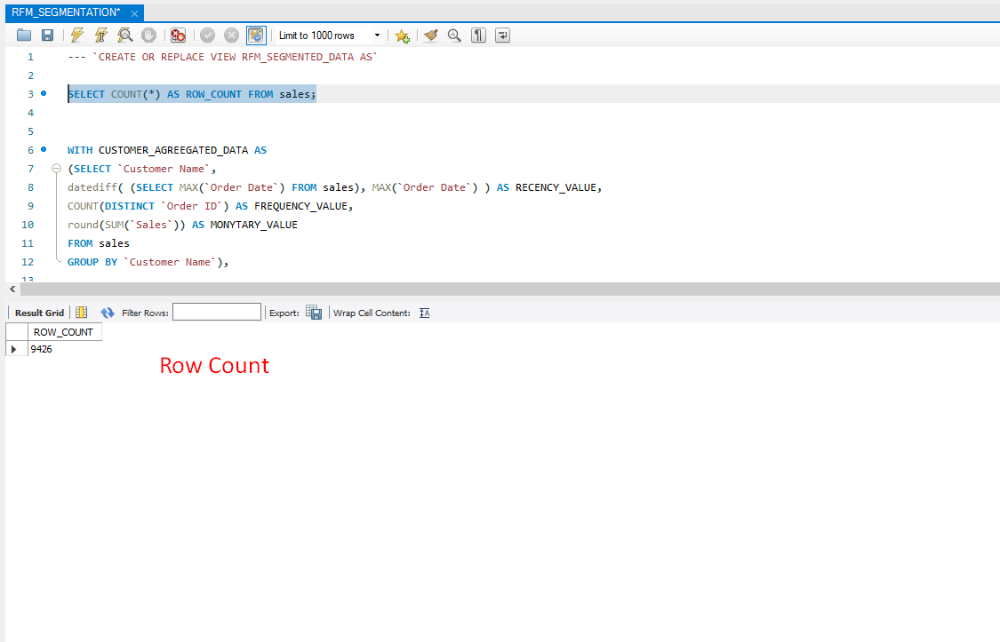
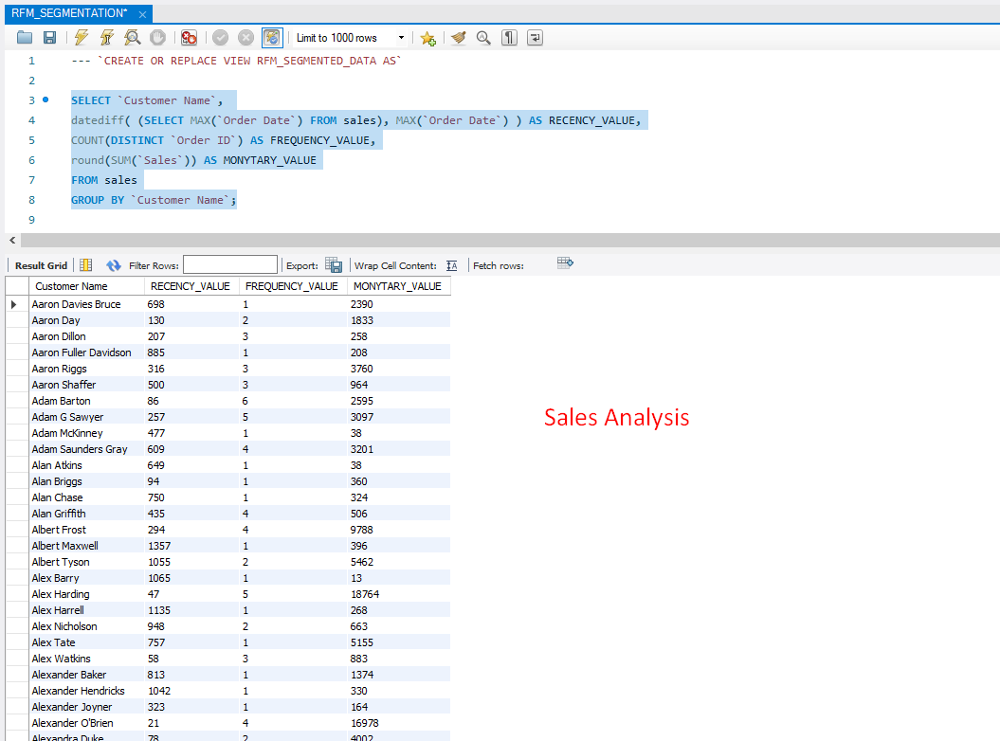
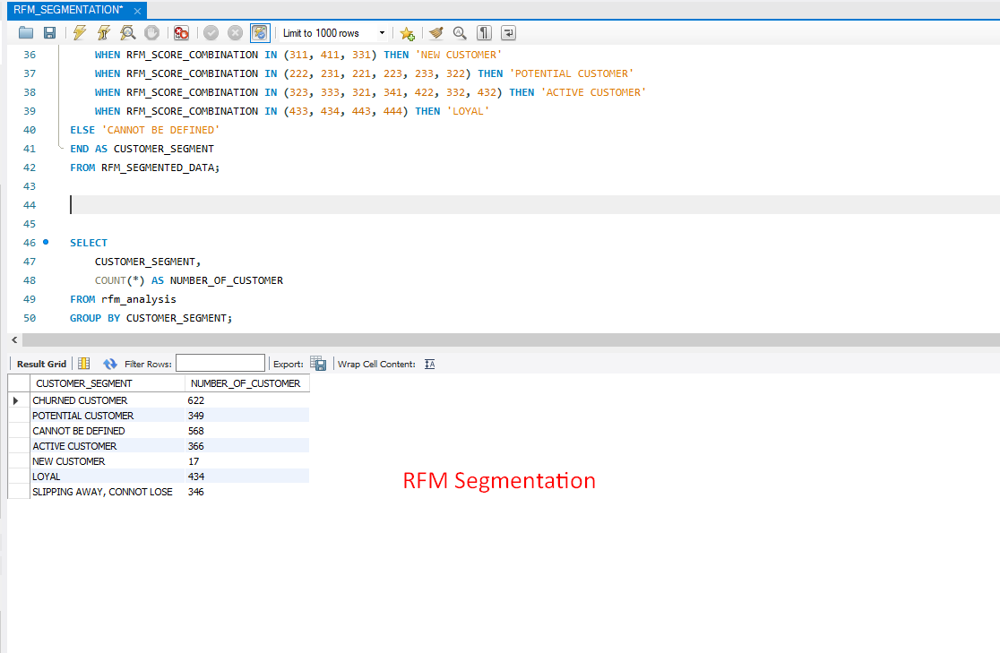

# Superstore Sales Analysis

## Overview
This project involves data exploration, cleaning, and analysis of a Superstore Sales dataset using MySQL. The goal is to extract insights, categorize customers using RFM segmentation, and perform exploratory data analysis (EDA) to improve business decision-making.

##  Key Features:
1. Database Creation & Data Import – Load the dataset into MySQL with bulk insertion.
2. Data Cleaning & Schema Optimization – Convert data types, handle missing values, and fix inconsistencies.
3. Exploratory Data Analysis (EDA) – Identify trends, top-performing products, and regional sales insights.
4. Customer Segmentation (RFM Analysis): Categorize customers into VIP, loyal, Big Spenders, and Churned segments.
5. SQL Queries for Business Insights – Analyze sales performance, customer behavior, and product demand.

## Files
📁 Superstore-Sales-Analysis  
- `Superstore_Sales_Data.xlsx`
- `IMPORT_EXPLORE_AND_CLEAN_DATA.sql`      
- `RFM_SEGMENTATION.sql`
- `EXPLANATORY_DATA_ANALYSIS.sql`

📂 Data  
- `Superstore_Sales_Data.csv`    
- `README.md` 

## 📊 Insights Gained:
- Top-selling products & categories.
- Best & worst performing regions.
- Customer purchase behavior analysis.
- Business recommendations for sales growth.
 

## 📊Visual Insights:

